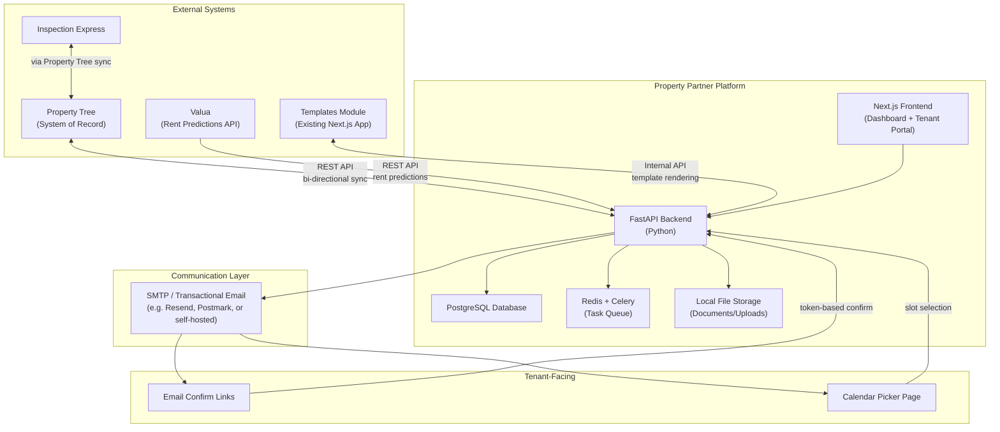
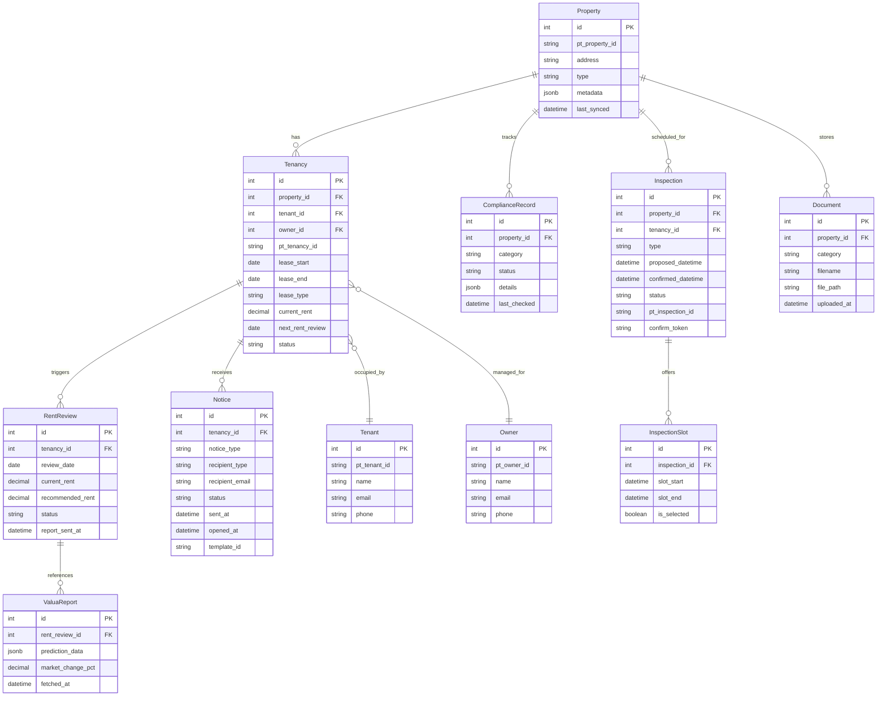
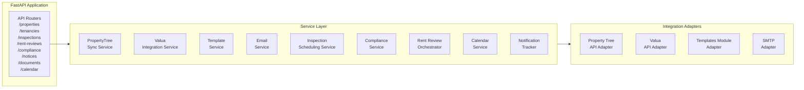
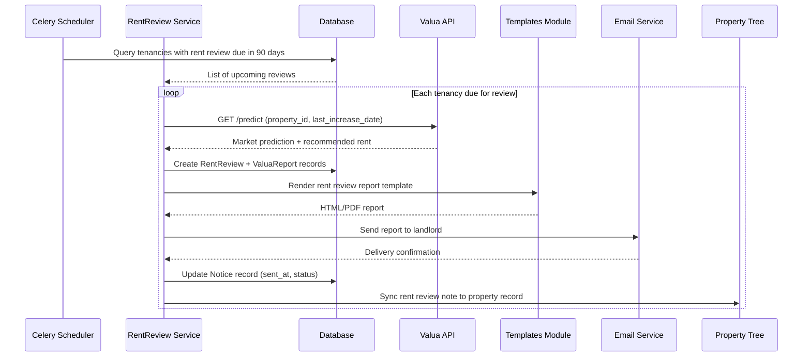
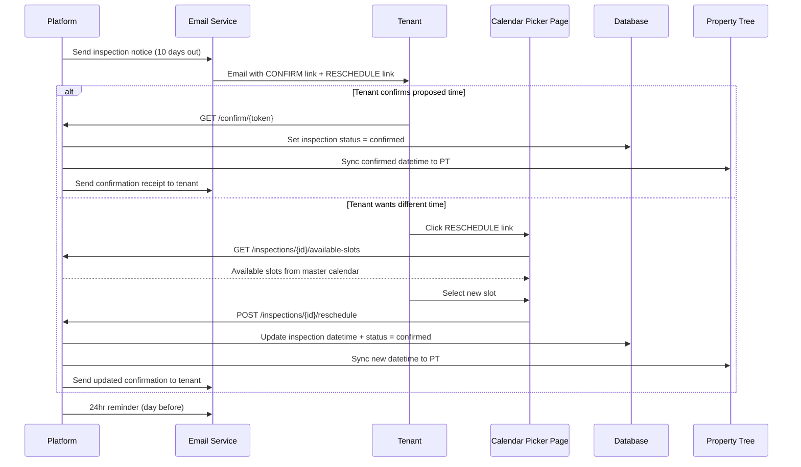
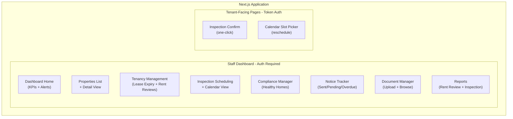
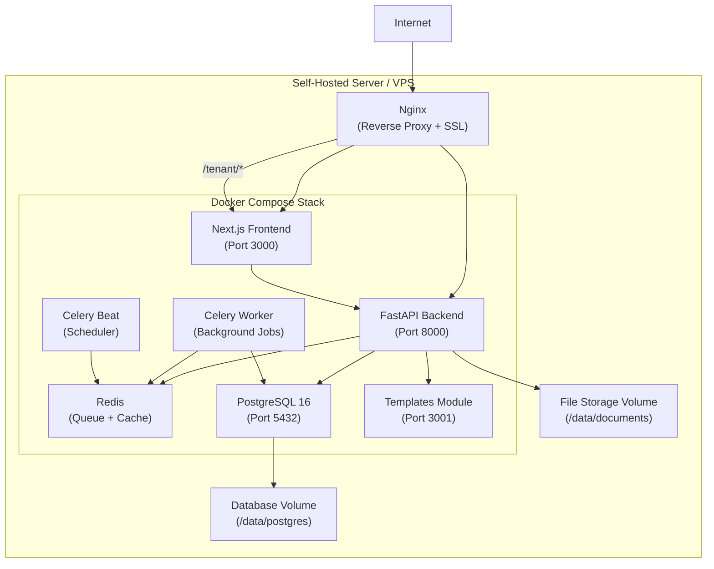

# Property Partner Workflow Management Platform -- Architecture Blueprint

---

## 1. System Context and Integration Landscape

The platform sits at the centre of your existing ecosystem, acting as a **workflow orchestration layer** that connects all existing systems into a single operational surface.



---

## 2. Tech Stack

| Layer | Technology | Rationale |

|---|---|---|

| **Frontend** | Next.js 15 (React) with Tailwind CSS v4 | Modern React framework; SSR for tenant-facing pages; consistent with existing templates module |

| **Backend API** | Python / FastAPI | Async-capable, fast, auto-generated OpenAPI docs, strong typing with Pydantic |

| **Database** | PostgreSQL 16 | Relational data (properties, leases, compliance, inspections); JSONB for flexible metadata |

| **Task Queue** | Redis + Celery | Async jobs: scheduled sync, automated rent review pipeline, email sending, reminder crons |

| **File Storage** | Local disk (with structured directories) | Self-hosted; documents, compliance uploads, reports. Abstracted behind a storage service so you can later move to S3 if needed |

| **Email** | SMTP integration (Postmark, Resend, or self-hosted Mailgun) | Transactional email with delivery tracking, open/click tracking for confirmation links |

| **Auth** | NextAuth.js (frontend) + JWT tokens (API) | Staff login for dashboard; token-based auth for tenant confirmation links |

| **Reverse Proxy** | Nginx | Self-hosted entry point, SSL termination, static file serving |

---

## 3. Core Database Schema (Key Entities)



Key design notes:

- Every record stores the corresponding Property Tree ID (`pt_*_id`) to enable bi-directional sync
- `Notice` tracks full delivery lifecycle: drafted, sent, delivered, opened, failed
- `Inspection` has a `confirm_token` for secure email-based confirmation links
- `ComplianceRecord` uses JSONB `details` for flexible Healthy Homes sub-categories (heating, insulation, ventilation, moisture, draught stopping)

---

## 4. Backend Module Architecture



### 4.1 Property Tree Sync Service

This is the most critical integration. The architecture abstracts the Property Tree API behind an **adapter pattern** so the rest of the system is decoupled from Property Tree's specific API shape.

**Sync strategy:**

- **Initial full sync**: On first connection, pull all properties, owners, tenants, tenancies, and inspection records
- **Incremental sync**: Scheduled Celery job (e.g. every 15 minutes) fetches records modified since last sync using a `last_modified` watermark
- **Write-back sync**: When our platform updates inspection status or scheduling, push changes to Property Tree immediately via API
- **Conflict resolution**: Property Tree remains system of record for financial data (rent ledger, disbursements). Our platform is authoritative for inspection scheduling and notice tracking

**Adapter abstraction** -- if Property Tree's API has gaps, the adapter can be extended to support CSV import/export or manual data entry as a fallback path without changing the rest of the codebase.

### 4.2 Rent Review Orchestrator (Automated Pipeline)

This is the automated workflow that ties Valua predictions to landlord communications:



Pipeline runs on a schedule (e.g. daily at 8am). Each step is idempotent -- if a review already has a report sent, it skips. Landlord follow-ups at 42 and 14 days are also scheduled as Celery tasks.

### 4.3 Inspection Scheduling and Calendar

This replaces the current manual Property Tree workflow with a managed calendar system:

**Master Calendar:**

- Admin sets recurring availability slots (e.g. Tuesdays 9am-12pm, Thursdays 1pm-4pm)
- Slots have configurable duration (e.g. 30 min per property)
- System auto-proposes inspection dates based on the quarterly cadence and available slots

**Tenant Confirmation Flow:**



Key design points:

- Confirmation links use a signed JWT token (single-use, time-limited) for security
- The calendar picker is a public-facing Next.js page (no login required, token-authenticated)
- All status changes immediately sync to Property Tree
- SMS reminders can be added via a Twilio/Vonage adapter alongside email

---

## 5. Frontend Architecture



### Staff Dashboard Pages

1. **Dashboard Home** -- KPI cards: properties under management, upcoming lease expiries (30/60/90 day), overdue rent reviews, upcoming inspections, compliance gaps. Alert feed for items needing attention.

2. **Properties** -- Filterable/searchable list of all synced properties. Detail view shows: tenancy info, compliance status, inspection history, rent review history, notices sent, documents.

3. **Tenancy Management** -- Pipeline view of lease expiries and rent reviews. Filters by date range, status (not started, in progress, landlord contacted, tenant notified, completed). Bulk actions for triggering rent review workflows.

4. **Inspection Scheduling** -- Calendar view (week/month). Drag-and-drop scheduling onto master calendar slots. Bulk scheduling for quarterly batches. Status indicators (proposed, sent, confirmed, completed).

5. **Compliance Manager** -- Property-by-property compliance checklist (heating, insulation, ventilation, moisture/drainage, draught stopping). Upload evidence documents per category. Status traffic light (compliant, gap identified, remediation in progress).

6. **Notice Tracker** -- Full audit trail of every notice sent: type, recipient, template used, sent date, delivery status, open status. Filterable by property, type, status.

7. **Document Manager** -- Upload, categorize, and browse documents per property. Categories align with Property Tree folder structure (01 Management, 02 Agreements, 03 Compliance, 04 Inspections, etc.).

### Tenant-Facing Pages

- **Inspection Confirm Page**: Token-authenticated landing page. Shows proposed date/time, property address. Single "Confirm" button. Success/already-confirmed states.

- **Calendar Slot Picker**: Token-authenticated. Shows available alternative slots from master calendar. Tenant selects preferred slot. Confirmation shown on success.

---

## 6. Templates Module Integration

The existing Next.js templates module will be integrated as a **service dependency** rather than being rebuilt:

- **Approach**: The templates module gets a new API layer (a small set of endpoints) that accepts template ID + merge data, and returns rendered HTML/PDF
- **Email functionality**: The new platform's Email Service handles all sending -- the templates module focuses only on rendering
- **Template types** to wire up: rent increase notice, move-out notice, inspection scheduling notice, inspection reminder, rent review report (landlord), lease expiry notice (tenant), lease expiry notice (landlord)

The templates module remains its own codebase but is deployed alongside the platform and called internally via HTTP.

---

## 7. Deployment Architecture (Self-Hosted)



Everything runs in a single Docker Compose stack:

- **Nginx** handles SSL termination, routes `/api/*` to FastAPI, everything else to Next.js
- **Celery Beat** triggers scheduled jobs (Property Tree sync, rent review pipeline, inspection reminders)
- **Celery Worker(s)** execute async tasks (email sending, API calls to Valua/PT, report generation)
- **Volumes** persist database data and uploaded documents across container restarts
- **Backup**: Scheduled `pg_dump` to a backup location; file storage rsync to backup

---

## 8. Scheduled Jobs (Celery Beat)

| Job | Frequency | Description |

|---|---|---|

| `sync_property_tree` | Every 15 min | Incremental sync of properties, tenancies, tenants, owners from PT |

| `scan_lease_expiries` | Daily 7am | Flag tenancies with lease expiry in 90/60/42/14 days; create reminder tasks |

| `run_rent_review_pipeline` | Daily 8am | For tenancies due for rent review: fetch Valua predictions, generate reports, send to landlords |

| `send_inspection_notices` | Daily 8am | Send 10-day scheduling emails for upcoming inspections |

| `send_inspection_reminders` | Daily 8am | Send 24-hour reminders for confirmed inspections |

| `chase_unconfirmed_inspections` | Daily 9am | Follow up on inspections with no tenant confirmation after 2 days |

| `sync_inspection_status_to_pt` | Every 5 min | Push any pending inspection status changes to Property Tree |

| `chase_landlord_renewals` | Daily 9am | Follow up on landlord renewal decisions per escalation cadence (42-day, 14-day) |

---

## 9. Security Considerations

- **Staff auth**: NextAuth.js with credentials provider (email/password) or OAuth (Google Workspace if used). Role-based: Admin, Property Manager, VA.
- **Tenant token auth**: Signed JWT tokens embedded in email links. Single-use for confirmation. Short expiry (7 days). No tenant login required.
- **API security**: All FastAPI endpoints require valid JWT. CORS restricted to frontend origin.
- **File uploads**: Validated file types (PDF, JPG, PNG, DOCX). Max size limits. Stored outside web root.
- **HTTPS**: Nginx with Let's Encrypt certificates.

---

## 10. Project Structure

```
property-partner-platform/
  docker-compose.yml
  nginx/
    nginx.conf
  backend/
    app/
      main.py                    # FastAPI app entry
      config.py                  # Settings (env vars)
      models/                    # SQLAlchemy models
      schemas/                   # Pydantic request/response schemas
      routers/                   # API route handlers
        properties.py
        tenancies.py
        inspections.py
        rent_reviews.py
        compliance.py
        notices.py
        documents.py
        calendar.py
        auth.py
        webhooks.py              # PT callback endpoints
      services/                  # Business logic
        property_tree_sync.py
        valua_integration.py
        template_service.py
        email_service.py
        inspection_scheduler.py
        rent_review_orchestrator.py
        compliance_service.py
        notification_tracker.py
        calendar_service.py
      adapters/                  # External system adapters
        property_tree_adapter.py
        valua_adapter.py
        template_adapter.py
        smtp_adapter.py
      tasks/                     # Celery tasks
        sync_tasks.py
        review_tasks.py
        inspection_tasks.py
        notification_tasks.py
      migrations/                # Alembic migrations
    requirements.txt
    Dockerfile
  frontend/
    src/
      app/                       # Next.js App Router
        (dashboard)/             # Staff dashboard (auth-protected)
          page.tsx               # Dashboard home
          properties/
          tenancies/
          inspections/
          compliance/
          notices/
          documents/
          reports/
        tenant/                  # Tenant-facing (token-auth)
          confirm/[token]/
          reschedule/[token]/
        api/                     # Next.js API routes (auth proxy)
      components/                # Shared UI components
      lib/                       # Utilities, API client
    package.json
    Dockerfile
    tailwind.css                 # Tailwind v4 (CSS-first config)
```

---

## 11. Implementation Phases

### Phase 1 -- Foundation (Weeks 1-3)

Set up the project skeleton: Docker Compose, FastAPI app with database models and migrations, Next.js frontend shell with auth, Property Tree adapter with initial full sync, basic property/tenancy list views.

### Phase 2 -- Lease and Rent Review Tracking (Weeks 4-5)

Lease expiry pipeline, rent review date tracking, Valua API integration, automated rent review report generation, notice sending with templates module integration, notice tracker dashboard.

### Phase 3 -- Inspection Management (Weeks 6-8)

Master calendar configuration, inspection scheduling engine, tenant confirmation flow (email confirm + calendar picker), bi-directional Property Tree sync for inspections, inspection dashboard with calendar view.

### Phase 4 -- Compliance and Documents (Weeks 9-10)

Compliance manager (Healthy Homes categories), document upload/storage/browsing, compliance status dashboard, link compliance records to Property Tree filing structure.

### Phase 5 -- Polish, QA, and Automation (Weeks 11-12)

All Celery scheduled jobs tested and running, full end-to-end workflow testing, dashboard KPIs and alerts, backup strategy deployed, documentation.

---

## 12. Key Risks and Mitigations

| Risk | Impact | Mitigation |

|---|---|---|

| Property Tree API has limited or undocumented endpoints | Cannot sync data automatically | Adapter pattern allows fallback to CSV import or manual data entry; investigate PT API access with MRI Software early |

| Email deliverability issues | Tenant confirmation links not received | Use a reputable transactional email provider (Postmark/Resend); implement delivery status tracking; SMS fallback via Twilio |

| Valua API downtime | Rent review pipeline stalls | Queue-based retry logic; manual override to enter predictions directly |

| Data conflicts between PT and platform | Inconsistent records | Clear ownership rules: PT owns financial data, platform owns scheduling/notices; conflict detection in sync service |